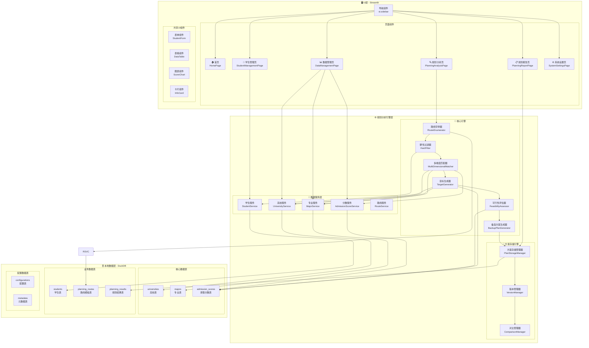
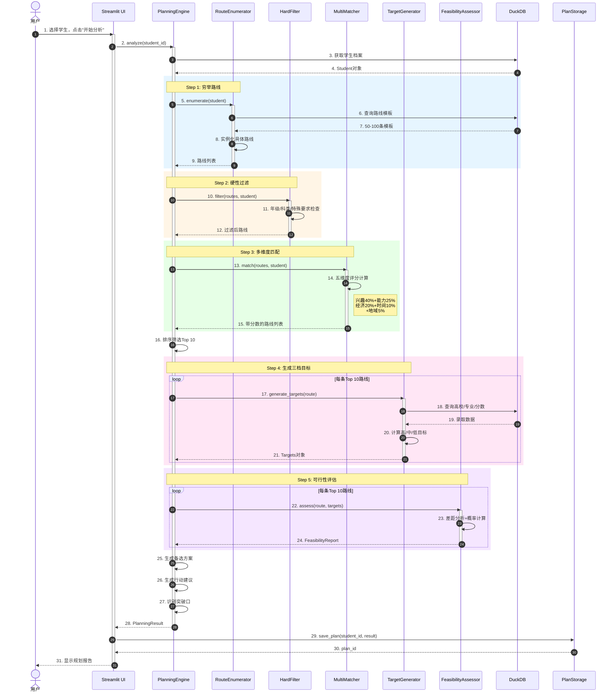
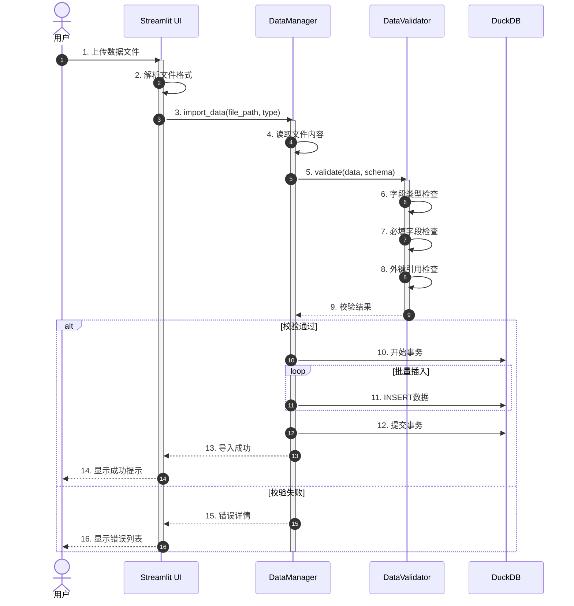
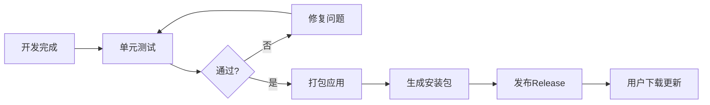
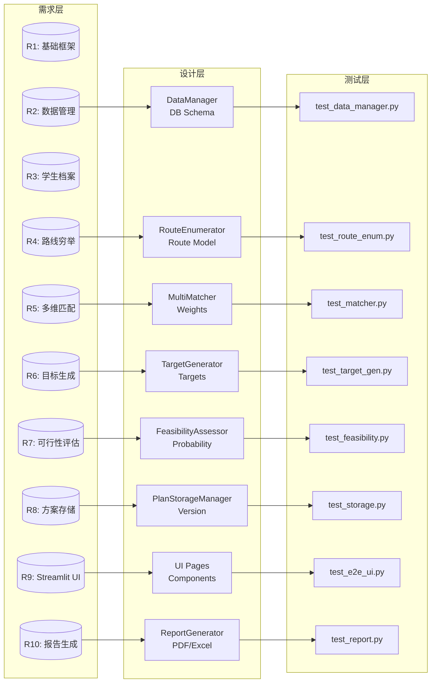
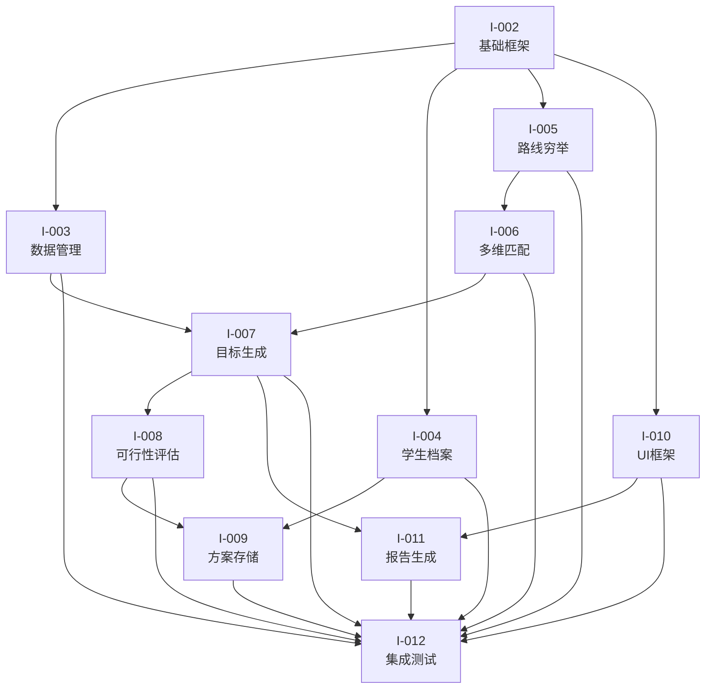

# 升学规划咨询系统 - 主设计文档 (V模型)

**文档版本**: v3.0  
**创建日期**: 2026-03-08  
**文档类型**: 主设计文档 (Master Design Document)  
**对应迭代**: I-001 ~ I-012

---

## 1. 文档概述

### 1.1 设计目标

本文档基于迭代V模型方法，对升学规划咨询系统进行全面设计和规划。目标包括：

- **追溯性**: 确保需求(R1-R10) → 设计 → 实现 → 验证的完整追溯链
- **可验证性**: 每个设计元素都有明确的验证方法和验收标准
- **可维护性**: 清晰的模块划分和接口定义，降低耦合度
- **可扩展性**: 预留扩展点，支持未来功能增强

### 1.2 设计原则

1. **分层架构**: UI层 → 引擎层 → 数据层，职责清晰分离
2. **领域驱动**: 围绕核心业务概念（学生、路线、目标）建立领域模型
3. **配置优先**: 可变化的部分（权重、阈值）通过配置而非硬编码
4. **防御编程**: 对输入数据进行严格校验，优雅处理边界情况

### 1.3 引用文档

- [01-requirements-v2.md](./01-requirements-v2.md) - 需求分析（修订版）
- [02-local-architecture.md](./02-local-architecture.md) - 本地程序架构设计
- [03-data-collection-v2.md](./03-data-collection-v2.md) - 数据收集方案
- [04-planning-engine.md](./04-planning-engine.md) - 规划分析引擎设计
- [05-ui-design.md](./05-ui-design.md) - 用户交互设计
- [06-development-plan-v2.md](./06-development-plan-v2.md) - 开发实施计划

---

## 2. 总体架构设计

### 2.1 系统架构图



### 2.2 组件职责详述

| 层级 | 组件名称 | 职责描述 | 对应需求 |
|------|---------|---------|---------|
| **UI层** | HomePage | 系统概览、快捷入口、统计看板 | R9 |
| | DataManagementPage | 高校/专业/分数数据的导入、查看、导出 | R2 |
| | StudentManagementPage | 学生档案的创建、编辑、删除、查看 | R3 |
| | PlanningAnalysisPage | 选择学生、配置分析参数、执行分析 | R4-R7 |
| | PlanningReportPage | 展示规划结果、导出报告 | R10 |
| | SystemSettingsPage | 系统配置、数据更新、备份恢复 | R1,R8 |
| **引擎层** | RouteEnumerator | 基于规则生成所有可能的升学路线（50-100条） | R4 |
| | HardFilter | 根据学生硬性条件剔除不可能路线 | R4 |
| | MultiDimensionalMatcher | 五维度评分计算（兴趣40%、能力25%、经济20%、时间10%、地域5%） | R5 |
| | TargetGenerator | 为Top10路线生成高/中/低三档目标 | R6 |
| | FeasibilityAssessor | 对比当前水平与目标要求，计算达成概率 | R7 |
| | BackupPlanGenerator | 生成备选方案（高目标不可行时的退路） | R7 |
| | PlanStorageManager | 方案持久化、查询、删除 | R8 |
| | VersionManager | 方案版本管理、历史记录 | R8 |
| | ComparisonManager | 版本对比、差异分析 | R8 |
| **数据层** | universities | 高校基本信息（985/211/双一流标识） | R2 |
| | majors | 专业信息（学科门类、就业方向） | R2 |
| | admission_scores | 录取分数数据（近5年、各专业、位次） | R2 |
| | students | 学生档案（基本信息、成绩、兴趣、家庭条件） | R3 |
| | planning_routes | 路线模板（50-100条预定义路线） | R4 |
| | planning_results | 规划结果（完整方案、时间戳、版本） | R8 |

---

## 3. 详细设计

### 3.1 数据模型设计

#### 3.1.1 高校表 (universities)

```sql
CREATE TABLE universities (
    id VARCHAR(20) PRIMARY KEY,           -- 高校代码，如"10001"
    name VARCHAR(100) NOT NULL,           -- 高校名称
    name_en VARCHAR(200),                 -- 英文名称
    province VARCHAR(50) NOT NULL,        -- 所在省份
    city VARCHAR(50),                     -- 所在城市
    level VARCHAR(20) NOT NULL,           -- 层次：985/211/双一流/普通本科
    type VARCHAR(50),                     -- 类型：综合/理工/师范/财经等
    is_985 BOOLEAN DEFAULT FALSE,         -- 是否985
    is_211 BOOLEAN DEFAULT FALSE,         -- 是否211
    is_double_first_class BOOLEAN DEFAULT FALSE,  -- 是否双一流
    founding_year INTEGER,                -- 建校年份
    website VARCHAR(200),                 -- 官网
    description TEXT,                     -- 简介
    created_at TIMESTAMP DEFAULT CURRENT_TIMESTAMP,
    updated_at TIMESTAMP DEFAULT CURRENT_TIMESTAMP
);

-- 索引
CREATE INDEX idx_univ_province ON universities(province);
CREATE INDEX idx_univ_level ON universities(level);
CREATE INDEX idx_univ_985 ON universities(is_985) WHERE is_985 = TRUE;
CREATE INDEX idx_univ_211 ON universities(is_211) WHERE is_211 = TRUE;
```

#### 3.1.2 专业表 (majors)

```sql
CREATE TABLE majors (
    id VARCHAR(20) PRIMARY KEY,           -- 专业代码
    code VARCHAR(20) NOT NULL,            -- 国标专业代码
    name VARCHAR(100) NOT NULL,           -- 专业名称
    category VARCHAR(50) NOT NULL,        -- 学科门类：哲学/经济学/法学等
    discipline VARCHAR(50),               -- 专业类：计算机类/金融学类等
    degree_type VARCHAR(20),              -- 学位类型：学士/硕士/博士
    duration INTEGER DEFAULT 4,           -- 学制年限
    career_direction TEXT,                -- 就业方向描述
    demand_level INTEGER CHECK (demand_level BETWEEN 1 AND 5),  -- 需求等级1-5
    salary_prospect VARCHAR(20),          -- 薪资前景：高/中/低
    related_subjects TEXT,                -- 相关学科，JSON数组
    created_at TIMESTAMP DEFAULT CURRENT_TIMESTAMP
);

-- 索引
CREATE INDEX idx_major_category ON majors(category);
CREATE INDEX idx_major_demand ON majors(demand_level);
```

#### 3.1.3 录取分数表 (admission_scores) - 核心大表

```sql
CREATE TABLE admission_scores (
    id INTEGER PRIMARY KEY,
    university_id VARCHAR(20) NOT NULL REFERENCES universities(id),
    major_id VARCHAR(20) NOT NULL REFERENCES majors(id),
    year INTEGER NOT NULL,                -- 年份：2021-2025
    subject_type VARCHAR(10) NOT NULL,    -- 科类：物理/历史
    
    -- 分数数据
    min_score INTEGER,                    -- 最低分
    min_rank INTEGER,                     -- 最低位次（关键指标）
    avg_score INTEGER,                    -- 平均分
    avg_rank INTEGER,                     -- 平均位次
    max_score INTEGER,                    -- 最高分
    
    -- 招生信息
    plan_count INTEGER,                   -- 计划招生人数
    actual_count INTEGER,                 -- 实际录取人数
    
    -- 特殊招生标识
    is_special_type BOOLEAN DEFAULT FALSE,  -- 是否特殊类型招生
    special_type VARCHAR(50),             -- 特殊类型：艺术/体育/综评等
    
    -- 元数据
    data_source VARCHAR(100),             -- 数据来源
    confidence_level INTEGER CHECK (confidence_level BETWEEN 1 AND 5),  -- 数据置信度
    created_at TIMESTAMP DEFAULT CURRENT_TIMESTAMP,
    
    -- 复合唯一约束
    UNIQUE(university_id, major_id, year, subject_type, special_type)
);

-- 核心索引（查询优化）
CREATE INDEX idx_score_univ_major ON admission_scores(university_id, major_id);
CREATE INDEX idx_score_year_subject ON admission_scores(year, subject_type);
CREATE INDEX idx_score_min_rank ON admission_scores(min_rank) WHERE min_rank IS NOT NULL;
CREATE INDEX idx_score_composite ON admission_scores(university_id, year, subject_type);
```

#### 3.1.4 学生表 (students)

```sql
CREATE TABLE students (
    id VARCHAR(36) PRIMARY KEY DEFAULT uuid(),
    
    -- 基本信息
    name VARCHAR(50) NOT NULL,            -- 姓名（加密存储）
    name_encrypted VARCHAR(200),          -- 加密后的姓名
    gender VARCHAR(10),                   -- 性别
    birth_date DATE,                      -- 出生日期
    grade VARCHAR(20) NOT NULL,           -- 年级：初一/初二/初三/高一/高二/高三
    current_school VARCHAR(100),          -- 当前学校（加密）
    school_encrypted VARCHAR(200),        -- 加密后的学校
    
    -- 学业信息
    subject_type VARCHAR(10),             -- 选科：物理/历史（高中）
    academic_scores JSON,                 -- 各科成绩，JSON格式
    total_score INTEGER,                  -- 总分
    class_rank INTEGER,                   -- 班级排名
    grade_rank INTEGER,                   -- 年级排名
    
    -- 兴趣特长
    interests JSON,                       -- 兴趣爱好列表
    special_talents JSON,                 -- 特长：艺术/体育/科技等
    
    -- 家庭条件
    family_conditions JSON,               -- 家庭条件：经济/地域/资源等
    
    -- 元数据
    created_at TIMESTAMP DEFAULT CURRENT_TIMESTAMP,
    updated_at TIMESTAMP DEFAULT CURRENT_TIMESTAMP,
    version INTEGER DEFAULT 1             -- 档案版本
);

-- 索引
CREATE INDEX idx_student_grade ON students(grade);
CREATE INDEX idx_student_updated ON students(updated_at);
```

#### 3.1.5 路线模板表 (planning_routes)

```sql
CREATE TABLE planning_routes (
    id VARCHAR(36) PRIMARY KEY DEFAULT uuid(),
    
    -- 基本信息
    name VARCHAR(100) NOT NULL,           -- 路线名称
    category VARCHAR(50) NOT NULL,        -- 类别：普通高考/科技特长/艺术特长/体育特长/拔尖人才/特殊类型/职业路线
    subcategory VARCHAR(50),              -- 子类别
    
    -- 适用条件
    target_grades JSON,                   -- 适用年级
    subject_type_requirement VARCHAR(10), -- 科类要求：物理/历史/不限
    
    -- 硬性要求
    requirements JSON,                    -- 详细要求条件
    min_score_threshold INTEGER,          -- 最低分数要求
    
    -- 资源投入
    time_cost VARCHAR(50),                -- 时间成本：如"3年持续投入"
    money_cost VARCHAR(50),               -- 经济成本：如"5-10万"
    difficulty INTEGER CHECK (difficulty BETWEEN 1 AND 5),  -- 难度1-5
    
    -- 成功概率参考
    success_rate DECIMAL(5,2),            -- 历史成功率
    
    -- 描述信息
    description TEXT,                     -- 路线描述
    advantages TEXT,                      -- 优势
    disadvantages TEXT,                   -- 劣势
    
    -- 排序权重
    sort_order INTEGER DEFAULT 0,         -- 排序顺序
    is_active BOOLEAN DEFAULT TRUE,       -- 是否启用
    
    created_at TIMESTAMP DEFAULT CURRENT_TIMESTAMP
);

-- 索引
CREATE INDEX idx_route_category ON planning_routes(category);
CREATE INDEX idx_route_active ON planning_routes(is_active) WHERE is_active = TRUE;
```

#### 3.1.6 规划结果表 (planning_results)

```sql
CREATE TABLE planning_results (
    id VARCHAR(36) PRIMARY KEY DEFAULT uuid(),
    student_id VARCHAR(36) NOT NULL REFERENCES students(id),
    
    -- 分析元数据
    created_at TIMESTAMP DEFAULT CURRENT_TIMESTAMP,
    data_version VARCHAR(20),             -- 数据版本
    engine_version VARCHAR(20),           -- 引擎版本
    
    -- 分析参数
    analysis_params JSON,                 -- 分析时的参数配置
    
    -- 核心结果（JSON存储）
    breakthrough_points JSON,             -- 突破口分析结果
    enumerated_routes_count INTEGER,      -- 穷举路线数
    filtered_routes_count INTEGER,        -- 过滤后路线数
    matched_routes JSON,                  -- 匹配后的路线列表（Top 10）
    
    -- 三档目标
    high_targets JSON,                    -- 高目标
    medium_targets JSON,                  -- 中目标
    low_targets JSON,                     -- 低目标
    
    -- 可行性评估
    feasibility_assessment JSON,          -- 可行性评估结果
    backup_plans JSON,                    -- 备选方案
    action_plan JSON,                     -- 行动建议
    
    -- 报告
    report_summary TEXT,                  -- 报告摘要
    is_active BOOLEAN DEFAULT TRUE,       -- 是否为当前有效方案
    
    -- 版本管理
    version_number INTEGER DEFAULT 1,     -- 版本号
    previous_version_id VARCHAR(36),      -- 上一版本ID
    
    FOREIGN KEY (previous_version_id) REFERENCES planning_results(id)
);

-- 索引
CREATE INDEX idx_result_student ON planning_results(student_id);
CREATE INDEX idx_result_created ON planning_results(created_at);
CREATE INDEX idx_result_active ON planning_results(student_id, is_active) WHERE is_active = TRUE;
CREATE INDEX idx_result_version ON planning_results(student_id, version_number);
```

---

### 3.2 模块接口设计

#### 3.2.1 数据管理层接口

```python
# src/data/data_manager.py

from abc import ABC, abstractmethod
from typing import List, Dict, Optional, Tuple
from dataclasses import dataclass
import pandas as pd


@dataclass
class ImportResult:
    """导入结果"""
    success: bool
    imported_count: int
    failed_count: int
    errors: List[Dict]
    duration_ms: int


@dataclass
class QueryResult:
    """查询结果"""
    data: pd.DataFrame
    total_count: int
    page: int
    page_size: int


class DataManager(ABC):
    """数据管理抽象基类"""
    
    @abstractmethod
    def import_universities(self, file_path: str, 
                           file_format: str = 'csv') -> ImportResult:
        """
        导入高校数据
        
        Args:
            file_path: 文件路径
            file_format: 文件格式 csv/excel/json
            
        Returns:
            ImportResult: 导入结果
        """
        pass
    
    @abstractmethod
    def import_majors(self, file_path: str, 
                     file_format: str = 'csv') -> ImportResult:
        """导入专业数据"""
        pass
    
    @abstractmethod
    def import_admission_scores(self, file_path: str,
                                year: int,
                                subject_type: str,
                                file_format: str = 'csv') -> ImportResult:
        """
        导入录取分数数据
        
        Args:
            file_path: 文件路径
            year: 年份
            subject_type: 科类（物理/历史）
            file_format: 文件格式
        """
        pass
    
    @abstractmethod
    def query_universities(self, 
                          filters: Optional[Dict] = None,
                          page: int = 1,
                          page_size: int = 100) -> QueryResult:
        """
        查询高校列表
        
        Args:
            filters: 过滤条件 {
                'level': ['985', '211'],
                'province': '辽宁',
                'type': '综合'
            }
            page: 页码
            page_size: 每页数量
            
        Returns:
            QueryResult: 查询结果
        """
        pass
    
    @abstractmethod
    def query_admission_scores(self,
                              university_id: Optional[str] = None,
                              major_id: Optional[str] = None,
                              year: Optional[int] = None,
                              subject_type: Optional[str] = None,
                              min_rank: Optional[int] = None,
                              max_rank: Optional[int] = None) -> pd.DataFrame:
        """
        查询录取分数
        
        Args:
            university_id: 高校ID
            major_id: 专业ID
            year: 年份
            subject_type: 科类
            min_rank: 最低位次
            max_rank: 最高位次
            
        Returns:
            DataFrame: 分数数据
        """
        pass
    
    @abstractmethod
    def export_data(self, 
                   data_type: str,
                   file_path: str,
                   file_format: str = 'csv',
                   filters: Optional[Dict] = None) -> bool:
        """
        导出数据
        
        Args:
            data_type: 数据类型 universities/majors/scores
            file_path: 导出路径
            file_format: 导出格式
            filters: 过滤条件
            
        Returns:
            bool: 是否成功
        """
        pass
    
    @abstractmethod
    def validate_data(self, data_type: str) -> Dict:
        """
        数据校验
        
        Args:
            data_type: 数据类型
            
        Returns:
            Dict: 校验结果 {
                'is_valid': bool,
                'total_count': int,
                'error_count': int,
                'errors': []
            }
        """
        pass


class DuckDBDataManager(DataManager):
    """DuckDB数据管理实现"""
    
    def __init__(self, db_path: str = 'data/edu_planning.db'):
        self.db_path = db_path
        self._init_database()
    
    def _init_database(self):
        """初始化数据库"""
        # 创建表结构
        pass
    
    # 实现抽象方法...
```

#### 3.2.2 规划引擎接口

```python
# src/engine/planning_engine.py

from typing import List, Dict, Optional
from dataclasses import dataclass, field
from enum import Enum


class RouteCategory(Enum):
    """路线类别"""
    NORMAL_GAOKE = "普通高考"
    TECH_TALENT = "科技特长生"
    ART_TALENT = "艺术特长生"
    SPORTS_TALENT = "体育特长生"
    ELITE_TALENT = "拔尖人才"
    SPECIAL_TYPE = "特殊类型"
    CAREER = "职业路线"


@dataclass
class StudentProfile:
    """学生画像"""
    id: str
    name: str
    grade: str
    subject_type: Optional[str]  # 物理/历史
    academic_scores: Dict[str, float]  # 各科成绩
    total_score: Optional[float]
    class_rank: Optional[int]
    grade_rank: Optional[int]
    interests: List[str]
    special_talents: List[Dict]  # [{type: '信息学', level: '省一'}]
    family_conditions: Dict  # {economic_level: '中', location: '辽宁'}


@dataclass
class Route:
    """升学路线"""
    id: str
    name: str
    category: RouteCategory
    subcategory: str
    requirements: Dict  # 硬性要求
    difficulty: int  # 1-5
    time_cost: str
    money_cost: str
    description: str


@dataclass
class MatchedRoute:
    """匹配后的路线"""
    route: Route
    match_score: float  # 0-100
    dimension_scores: Dict[str, float]  # 各维度得分
    is_feasible: bool
    feasibility_reason: Optional[str]


@dataclass
class Target:
    """目标（高校+专业）"""
    university_id: str
    university_name: str
    university_level: str
    major_id: str
    major_name: str
    required_score: int
    required_rank: int
    success_probability: float  # 0-1


@dataclass
class Targets:
    """三档目标"""
    high: List[Target]  # 高目标（冲刺）
    medium: List[Target]  # 中目标（稳妥）
    low: List[Target]  # 低目标（保底）


@dataclass
class FeasibilityReport:
    """可行性报告"""
    route_id: str
    current_level: str  # 当前水平描述
    target_requirements: Dict  # 目标要求
    gap_analysis: Dict  # 差距分析
    probability: float  # 达成概率
    time_estimate: str  # 预计时间
    risk_factors: List[str]  # 风险因素
    recommendations: List[str]  # 建议


@dataclass
class PlanningResult:
    """规划结果"""
    student_id: str
    created_at: str
    data_version: str
    
    # 分析过程
    enumerated_count: int
    filtered_count: int
    matched_routes: List[MatchedRoute]
    
    # 核心结果
    breakthrough_points: List[str]
    targets: Targets
    feasibility: Dict[str, FeasibilityReport]
    backup_plans: List[Dict]
    action_plan: List[Dict]


class PlanningEngine:
    """规划分析引擎"""
    
    def __init__(self, data_manager: DataManager, config: Dict):
        self.data_manager = data_manager
        self.config = config
        
        # 子引擎
        self.route_enumerator = RouteEnumerator(config)
        self.hard_filter = HardFilter(config)
        self.matcher = MultiDimensionalMatcher(config)
        self.target_generator = TargetGenerator(data_manager, config)
        self.feasibility_assessor = FeasibilityAssessor(config)
        self.backup_generator = BackupPlanGenerator(config)
    
    def analyze(self, student: StudentProfile, 
                options: Optional[Dict] = None) -> PlanningResult:
        """
        执行完整规划分析
        
        Args:
            student: 学生画像
            options: 分析选项 {
                'route_categories': ['普通高考', '科技特长生'],  # 限定路线类别
                'target_count': 10,  # 目标数量
                'enable_backup': True,  # 是否生成备选
            }
            
        Returns:
            PlanningResult: 规划结果
            
        Raises:
            PlanningEngineError: 分析失败
        """
        # Step 1: 穷举路线
        all_routes = self.route_enumerator.enumerate(student)
        
        # Step 2: 硬性过滤
        filtered_routes = self.hard_filter.filter(all_routes, student)
        
        # Step 3: 多维度匹配
        matched_routes = self.matcher.match(filtered_routes, student)
        
        # Step 4: 排序筛选Top N
        top_routes = sorted(matched_routes, 
                          key=lambda x: x.match_score, 
                          reverse=True)[:self.config.get('top_n', 10)]
        
        # Step 5: 生成三档目标
        targets = {}
        feasibility = {}
        for matched in top_routes:
            route_targets = self.target_generator.generate(matched.route, student)
            targets[matched.route.id] = route_targets
            
            # Step 6: 可行性评估
            feasibility[matched.route.id] = self.feasibility_assessor.assess(
                matched.route, route_targets, student
            )
        
        # Step 7: 生成备选方案
        backup_plans = self.backup_generator.generate(top_routes, targets, feasibility)
        
        # Step 8: 生成行动建议
        action_plan = self._generate_action_plan(top_routes, targets, feasibility)
        
        # 识别突破口
        breakthrough_points = self._identify_breakthroughs(top_routes)
        
        return PlanningResult(
            student_id=student.id,
            created_at=datetime.now().isoformat(),
            data_version=self._get_data_version(),
            enumerated_count=len(all_routes),
            filtered_count=len(filtered_routes),
            matched_routes=top_routes,
            breakthrough_points=breakthrough_points,
            targets=targets,
            feasibility=feasibility,
            backup_plans=backup_plans,
            action_plan=action_plan
        )
    
    def _identify_breakthroughs(self, routes: List[MatchedRoute]) -> List[str]:
        """识别突破口"""
        breakthroughs = []
        
        # 分析高分路线特征
        high_score_routes = [r for r in routes if r.match_score > 80]
        
        # 提取共同特征作为突破口
        categories = set(r.route.category for r in high_score_routes)
        for cat in categories:
            breakthroughs.append(f"{cat.value}方向具有较高匹配度")
        
        return breakthroughs
    
    def _generate_action_plan(self, routes: List[MatchedRoute],
                             targets: Dict,
                             feasibility: Dict) -> List[Dict]:
        """生成行动建议"""
        actions = []
        
        # 按优先级排序
        for i, route in enumerate(routes[:3], 1):
            actions.append({
                'priority': i,
                'route': route.route.name,
                'action': f"重点发展{route.route.category.value}方向",
                'timeline': route.route.time_cost,
                'milestones': self._generate_milestones(route.route)
            })
        
        return actions
    
    def _generate_milestones(self, route: Route) -> List[Dict]:
        """生成里程碑"""
        # 根据路线类型生成不同的里程碑
        milestones = []
        
        if route.category == RouteCategory.TECH_TALENT:
            milestones = [
                {'phase': '初中', 'goal': '掌握编程基础，参加入门竞赛'},
                {'phase': '高一', 'goal': '参加NOIP初赛，获得省三'},
                {'phase': '高二', 'goal': 'NOIP提高组，争取省一'},
            ]
        elif route.category == RouteCategory.NORMAL_GAOKE:
            milestones = [
                {'phase': '高一', 'goal': '打好基础，年级前30%'},
                {'phase': '高二', 'goal': '稳步提升，年级前20%'},
                {'phase': '高三', 'goal': '冲刺阶段，保持稳定发挥'},
            ]
        
        return milestones


class RouteEnumerator:
    """路线穷举器"""
    
    def __init__(self, config: Dict):
        self.config = config
        self.route_templates = self._load_route_templates()
    
    def enumerate(self, student: StudentProfile) -> List[Route]:
        """
        穷举所有可能的升学路线
        
        Args:
            student: 学生画像
            
        Returns:
            List[Route]: 路线列表（50-100条）
        """
        routes = []
        
        for template in self.route_templates:
            # 根据模板和学生年级生成具体路线
            route = self._instantiate_route(template, student)
            if route:
                routes.append(route)
        
        return routes
    
    def _load_route_templates(self) -> List[Dict]:
        """加载路线模板"""
        # 从数据库或配置文件加载
        pass
    
    def _instantiate_route(self, template: Dict, 
                          student: StudentProfile) -> Optional[Route]:
        """实例化路线"""
        # 根据模板和学生情况生成具体路线
        pass


class HardFilter:
    """硬性过滤器"""
    
    def __init__(self, config: Dict):
        self.config = config
    
    def filter(self, routes: List[Route], 
               student: StudentProfile) -> List[Route]:
        """
        根据硬性条件过滤不可能路线
        
        过滤条件：
        1. 年级匹配
        2. 科类要求
        3. 硬性门槛（如竞赛奖项要求）
        """
        filtered = []
        
        for route in routes:
            if self._is_eligible(route, student):
                filtered.append(route)
        
        return filtered
    
    def _is_eligible(self, route: Route, 
                     student: StudentProfile) -> bool:
        """检查是否满足硬性条件"""
        # 检查年级
        if student.grade not in route.requirements.get('target_grades', []):
            return False
        
        # 检查科类
        required_subject = route.requirements.get('subject_type')
        if required_subject and student.subject_type != required_subject:
            return False
        
        # 检查特殊要求
        special_req = route.requirements.get('special_requirements')
        if special_req:
            if not self._check_special_requirements(special_req, student):
                return False
        
        return True
    
    def _check_special_requirements(self, requirements: Dict,
                                    student: StudentProfile) -> bool:
        """检查特殊要求（如竞赛奖项）"""
        # 实现特殊要求检查逻辑
        pass


class MultiDimensionalMatcher:
    """多维度匹配器"""
    
    # 默认权重配置
    DEFAULT_WEIGHTS = {
        'interest': 0.40,      # 兴趣匹配 40%
        'ability': 0.25,       # 能力匹配 25%
        'economic': 0.20,      # 经济匹配 20%
        'time': 0.10,          # 时间匹配 10%
        'location': 0.05       # 地域匹配 5%
    }
    
    def __init__(self, config: Dict):
        self.weights = config.get('dimension_weights', self.DEFAULT_WEIGHTS)
    
    def match(self, routes: List[Route], 
              student: StudentProfile) -> List[MatchedRoute]:
        """
        计算路线与学生的多维度匹配度
        
        Args:
            routes: 候选路线列表
            student: 学生画像
            
        Returns:
            List[MatchedRoute]: 带匹配分数的路线
        """
        matched = []
        
        for route in routes:
            scores = self._calculate_dimension_scores(route, student)
            total_score = sum(
                scores[dim] * weight 
                for dim, weight in self.weights.items()
            )
            
            matched.append(MatchedRoute(
                route=route,
                match_score=total_score,
                dimension_scores=scores,
                is_feasible=total_score >= 60,  # 60分以下为不可行
                feasibility_reason=None if total_score >= 60 else "匹配度不足"
            ))
        
        return matched
    
    def _calculate_dimension_scores(self, route: Route,
                                    student: StudentProfile) -> Dict[str, float]:
        """计算各维度得分"""
        return {
            'interest': self._score_interest(route, student),
            'ability': self._score_ability(route, student),
            'economic': self._score_economic(route, student),
            'time': self._score_time(route, student),
            'location': self._score_location(route, student)
        }
    
    def _score_interest(self, route: Route, 
                        student: StudentProfile) -> float:
        """兴趣匹配得分 0-100"""
        # 实现兴趣匹配算法
        # 例如：路线涉及的专业方向与学生兴趣的重合度
        pass
    
    def _score_ability(self, route: Route,
                       student: StudentProfile) -> float:
        """能力匹配得分 0-100"""
        # 实现能力匹配算法
        pass
    
    def _score_economic(self, route: Route,
                        student: StudentProfile) -> float:
        """经济匹配得分 0-100"""
        # 实现经济匹配算法
        pass
    
    def _score_time(self, route: Route,
                    student: StudentProfile) -> float:
        """时间匹配得分 0-100"""
        # 实现时间匹配算法
        pass
    
    def _score_location(self, route: Route,
                        student: StudentProfile) -> float:
        """地域匹配得分 0-100"""
        # 实现地域匹配算法
        pass


class TargetGenerator:
    """目标生成器"""
    
    def __init__(self, data_manager: DataManager, config: Dict):
        self.data_manager = data_manager
        self.config = config
    
    def generate(self, route: Route, 
                 student: StudentProfile) -> Targets:
        """
        为路线生成高/中/低三档目标
        
        Args:
            route: 升学路线
            student: 学生画像
            
        Returns:
            Targets: 三档目标
        """
        # 查询符合条件的高校专业
        candidates = self._query_candidate_targets(route, student)
        
        # 根据学生水平分层
        high = self._select_high_targets(candidates, student)
        medium = self._select_medium_targets(candidates, student)
        low = self._select_low_targets(candidates, student)
        
        return Targets(high=high, medium=medium, low=low)
    
    def _query_candidate_targets(self, route: Route,
                                  student: StudentProfile) -> pd.DataFrame:
        """查询候选目标"""
        # 根据路线类型和学生条件查询数据库
        pass
    
    def _select_high_targets(self, candidates: pd.DataFrame,
                            student: StudentProfile) -> List[Target]:
        """选择高目标（冲刺）- 需要努力可达"""
        # 选择略高于当前水平的目标
        pass
    
    def _select_medium_targets(self, candidates: pd.DataFrame,
                               student: StudentProfile) -> List[Target]:
        """选择中目标（稳妥）- 正常发挥可达"""
        # 选择与当前水平匹配的目标
        pass
    
    def _select_low_targets(self, candidates: pd.DataFrame,
                            student: StudentProfile) -> List[Target]:
        """选择低目标（保底）- 基本可达成"""
        # 选择低于当前水平的目标
        pass


class FeasibilityAssessor:
    """可行性评估器"""
    
    def __init__(self, config: Dict):
        self.config = config
    
    def assess(self, route: Route,
               targets: Targets,
               student: StudentProfile) -> FeasibilityReport:
        """
        评估路线可行性
        
        Args:
            route: 升学路线
            targets: 三档目标
            student: 学生画像
            
        Returns:
            FeasibilityReport: 可行性报告
        """
        # 分析当前水平
        current_level = self._assess_current_level(student)
        
        # 分析目标要求
        target_requirements = self._analyze_target_requirements(targets)
        
        # 差距分析
        gap_analysis = self._analyze_gap(current_level, target_requirements)
        
        # 计算达成概率
        probability = self._calculate_probability(gap_analysis, route)
        
        # 识别风险因素
        risk_factors = self._identify_risks(route, student, gap_analysis)
        
        # 生成建议
        recommendations = self._generate_recommendations(
            gap_analysis, risk_factors
        )
        
        return FeasibilityReport(
            route_id=route.id,
            current_level=current_level,
            target_requirements=target_requirements,
            gap_analysis=gap_analysis,
            probability=probability,
            time_estimate=route.time_cost,
            risk_factors=risk_factors,
            recommendations=recommendations
        )
    
    def _assess_current_level(self, student: StudentProfile) -> str:
        """评估当前水平"""
        # 基于成绩、排名等评估
        pass
    
    def _analyze_target_requirements(self, targets: Targets) -> Dict:
        """分析目标要求"""
        # 分析三档目标的具体要求
        pass
    
    def _analyze_gap(self, current: str, requirements: Dict) -> Dict:
        """分析差距"""
        # 计算当前水平与目标的差距
        pass
    
    def _calculate_probability(self, gap: Dict, route: Route) -> float:
        """计算达成概率"""
        # 基于历史数据和差距计算概率
        pass
    
    def _identify_risks(self, route: Route,
                        student: StudentProfile,
                        gap: Dict) -> List[str]:
        """识别风险因素"""
        # 识别可能影响成功的风险
        pass
    
    def _generate_recommendations(self, gap: Dict,
                                   risks: List[str]) -> List[str]:
        """生成建议"""
        # 基于差距和风险生成改进建议
        pass


class BackupPlanGenerator:
    """备选方案生成器"""
    
    def __init__(self, config: Dict):
        self.config = config
    
    def generate(self, routes: List[MatchedRoute],
                 targets: Dict[str, Targets],
                 feasibility: Dict[str, FeasibilityReport]) -> List[Dict]:
        """
        生成备选方案
        
        策略：
        - 高目标不可行 → 降低高校层次，保留专业方向
        - 中目标不可行 → 调整专业方向，保留高校层次
        - 低目标不可行 → 考虑其他路线类型
        """
        backup_plans = []
        
        for route in routes:
            if feasibility[route.route.id].probability < 0.3:
                # 生成该路线的备选方案
                backup = self._generate_for_route(
                    route.route, targets[route.route.id]
                )
                backup_plans.append({
                    'original_route': route.route.name,
                    'backup_options': backup
                })
        
        return backup_plans
    
    def _generate_for_route(self, route: Route, 
                           targets: Targets) -> List[Dict]:
        """为单个路线生成备选"""
        # 实现备选方案生成逻辑
        pass
```

#### 3.2.3 方案存储管理接口

```python
# src/storage/plan_storage.py

from typing import List, Optional
from dataclasses import dataclass
from datetime import datetime


@dataclass
class VersionInfo:
    """版本信息"""
    version_id: str
    version_number: int
    created_at: datetime
    is_active: bool
    summary: str


@dataclass
class DiffReport:
    """差异报告"""
    version_from: str
    version_to: str
    added_targets: List[Dict]
    removed_targets: List[Dict]
    modified_targets: List[Dict]
    score_changes: Dict[str, float]


class PlanStorageManager:
    """方案存储管理器"""
    
    def __init__(self, data_manager: DataManager):
        self.data_manager = data_manager
    
    def save_plan(self, student_id: str, 
                  plan: PlanningResult) -> str:
        """
        保存规划方案
        
        Args:
            student_id: 学生ID
            plan: 规划结果
            
        Returns:
            str: 方案ID
        """
        # 生成新版本号
        version = self._get_next_version(student_id)
        
        # 将之前版本标记为非活跃
        self._deactivate_previous_versions(student_id)
        
        # 保存新方案
        plan_id = self._insert_plan(student_id, plan, version)
        
        return plan_id
    
    def load_plan(self, plan_id: str) -> PlanningResult:
        """
        加载规划方案
        
        Args:
            plan_id: 方案ID
            
        Returns:
            PlanningResult: 规划结果
        """
        # 从数据库查询
        pass
    
    def list_versions(self, student_id: str) -> List[VersionInfo]:
        """
        列出学生的所有方案版本
        
        Args:
            student_id: 学生ID
            
        Returns:
            List[VersionInfo]: 版本列表
        """
        # 查询所有版本
        pass
    
    def compare_versions(self, version_id_1: str,
                        version_id_2: str) -> DiffReport:
        """
        对比两个版本
        
        Args:
            version_id_1: 版本1 ID
            version_id_2: 版本2 ID
            
        Returns:
            DiffReport: 差异报告
        """
        # 加载两个版本
        plan1 = self.load_plan(version_id_1)
        plan2 = self.load_plan(version_id_2)
        
        # 计算差异
        return self._calculate_diff(plan1, plan2)
    
    def activate_version(self, plan_id: str) -> bool:
        """
        激活指定版本
        
        Args:
            plan_id: 方案ID
            
        Returns:
            bool: 是否成功
        """
        # 标记为活跃版本
        pass
    
    def delete_version(self, plan_id: str) -> bool:
        """
        删除版本
        
        Args:
            plan_id: 方案ID
            
        Returns:
            bool: 是否成功
        """
        # 软删除或硬删除
        pass
    
    def _get_next_version(self, student_id: str) -> int:
        """获取下一个版本号"""
        pass
    
    def _deactivate_previous_versions(self, student_id: str):
        """停用之前的版本"""
        pass
    
    def _insert_plan(self, student_id: str,
                     plan: PlanningResult, version: int) -> str:
        """插入方案"""
        pass
    
    def _calculate_diff(self, plan1: PlanningResult,
                        plan2: PlanningResult) -> DiffReport:
        """计算差异"""
        pass
```

---

### 3.3 主流程设计

#### 3.3.1 规划分析流程时序图



#### 3.3.2 数据导入流程时序图



---

### 3.4 错误处理设计

#### 3.4.1 异常层次结构

```python
# src/exceptions.py

class EduPlanningException(Exception):
    """基础异常"""
    def __init__(self, message: str, error_code: str = None):
        self.message = message
        self.error_code = error_code
        super().__init__(self.message)


class DataException(EduPlanningException):
    """数据相关异常"""
    pass


class DataImportException(DataException):
    """数据导入异常"""
    def __init__(self, message: str, row_number: int = None, 
                 column_name: str = None):
        self.row_number = row_number
        self.column_name = column_name
        super().__init__(message, "DATA_IMPORT_ERROR")


class DataValidationException(DataException):
    """数据校验异常"""
    def __init__(self, message: str, validation_errors: List[Dict]):
        self.validation_errors = validation_errors
        super().__init__(message, "DATA_VALIDATION_ERROR")


class PlanningEngineException(EduPlanningException):
    """规划引擎异常"""
    pass


class RouteEnumerationException(PlanningEngineException):
    """路线穷举异常"""
    pass


class FeasibilityAssessmentException(PlanningEngineException):
    """可行性评估异常"""
    pass


class StorageException(EduPlanningException):
    """存储异常"""
    pass


class VersionConflictException(StorageException):
    """版本冲突异常"""
    pass
```

#### 3.4.2 错误处理策略

| 错误类型 | 发生场景 | 传播方式 | 用户可见行为 | 恢复策略 |
|---------|---------|---------|-------------|---------|
| DataImportException | 导入数据格式错误 | 向上抛出 | 弹窗显示具体行/列错误 | 提供修复模板下载 |
| DataValidationException | 数据完整性校验失败 | 向上抛出 | 列表展示所有校验错误 | 支持部分导入/跳过错误 |
| RouteEnumerationException | 路线穷举失败 | 记录日志，返回空列表 | 提示"暂无可推荐路线" | 检查路线模板配置 |
| FeasibilityAssessmentException | 缺乏评估数据 | 返回默认评估 | 显示"评估数据不完整"警告 | 引导用户补充数据 |
| VersionConflictException | 版本并发冲突 | 重试机制 | 提示"请重新操作" | 自动重试3次 |
| DatabaseConnectionException | 数据库连接失败 | 向上抛出 | 错误页面，提供恢复选项 | 检查数据库文件完整性 |

---

### 3.5 可观测性设计

#### 3.5.1 日志设计

```python
# src/utils/logger.py

import logging
from datetime import datetime


class ColoredFormatter(logging.Formatter):
    """带颜色的日志格式化器"""
    
    COLORS = {
        'DEBUG': '\033[36m',     # 青色
        'INFO': '\033[32m',      # 绿色
        'WARNING': '\033[33m',   # 黄色
        'ERROR': '\033[31m',     # 红色
        'CRITICAL': '\033[35m',  # 紫色
    }
    RESET = '\033[0m'
    
    def format(self, record):
        log_color = self.COLORS.get(record.levelname, self.RESET)
        record.levelname = f"{log_color}{record.levelname}{self.RESET}"
        return super().format(record)


def setup_logger(name: str, level: int = logging.INFO) -> logging.Logger:
    """配置日志记录器"""
    logger = logging.getLogger(name)
    logger.setLevel(level)
    
    # 控制台处理器
    console_handler = logging.StreamHandler()
    console_handler.setLevel(level)
    
    # 文件处理器
    file_handler = logging.FileHandler(
        f'logs/{name}_{datetime.now().strftime("%Y%m%d")}.log'
    )
    file_handler.setLevel(logging.DEBUG)
    
    # 格式化器
    console_formatter = ColoredFormatter(
        '%(asctime)s - %(name)s - %(levelname)s - %(message)s'
    )
    file_formatter = logging.Formatter(
        '%(asctime)s - %(name)s - %(levelname)s - [%(filename)s:%(lineno)d] - %(message)s'
    )
    
    console_handler.setFormatter(console_formatter)
    file_handler.setFormatter(file_formatter)
    
    logger.addHandler(console_handler)
    logger.addHandler(file_handler)
    
    return logger


# 使用示例
logger = setup_logger('planning_engine')
logger.info('开始规划分析', extra={'student_id': 'stu_001'})
logger.debug('穷举路线完成', extra={'count': 85})
logger.error('数据库连接失败', exc_info=True)
```

#### 3.5.2 性能指标

| 指标名称 | 说明 | 目标值 | 监控方式 |
|---------|------|--------|---------|
| 路线穷举耗时 | 生成所有路线的时间 | < 100ms | 日志记录 |
| 完整分析耗时 | 从输入到输出的总时间 | < 5秒 | Streamlit进度条 |
| 数据库查询耗时 | 单次查询时间 | < 50ms | 查询日志 |
| 匹配路线数 | 最终匹配的有效路线数量 | 10-20条 | 结果展示 |
| 内存占用 | 分析过程中的内存使用 | < 500MB | 系统监控 |

---

### 3.6 安全/隐私设计

#### 3.6.1 数据加密

```python
# src/utils/encryption.py

from cryptography.fernet import Fernet
from cryptography.hazmat.primitives import hashes
from cryptography.hazmat.primitives.kdf.pbkdf2 import PBKDF2HMAC
import base64
import os


class DataEncryptor:
    """数据加密器"""
    
    def __init__(self, password: str = None):
        """
        初始化加密器
        
        Args:
            password: 加密密码，不提供则使用默认
        """
        if password is None:
            password = os.environ.get('EDU_PLANNING_KEY', 'default_key_change_in_production')
        
        self.key = self._generate_key(password)
        self.cipher = Fernet(self.key)
    
    def _generate_key(self, password: str) -> bytes:
        """生成加密密钥"""
        kdf = PBKDF2HMAC(
            algorithm=hashes.SHA256(),
            length=32,
            salt=b'edu_planning_salt_v1',  # 固定盐值（生产环境应随机生成并存储）
            iterations=100000,
        )
        key = base64.urlsafe_b64encode(kdf.derive(password.encode()))
        return key
    
    def encrypt(self, data: str) -> str:
        """加密字符串"""
        return self.cipher.encrypt(data.encode()).decode()
    
    def decrypt(self, encrypted_data: str) -> str:
        """解密字符串"""
        return self.cipher.decrypt(encrypted_data.encode()).decode()
    
    def encrypt_dict(self, data: dict) -> dict:
        """加密字典中的敏感字段"""
        sensitive_fields = ['name', 'current_school', 'phone', 'email']
        encrypted = data.copy()
        
        for field in sensitive_fields:
            if field in encrypted and encrypted[field]:
                encrypted[field] = self.encrypt(str(encrypted[field]))
        
        return encrypted
    
    def decrypt_dict(self, data: dict) -> dict:
        """解密字典中的敏感字段"""
        sensitive_fields = ['name', 'current_school', 'phone', 'email']
        decrypted = data.copy()
        
        for field in sensitive_fields:
            if field in decrypted and decrypted[field]:
                try:
                    decrypted[field] = self.decrypt(decrypted[field])
                except:
                    pass  # 如果解密失败，保留原值
        
        return decrypted


# 使用示例
encryptor = DataEncryptor()

# 加密学生姓名
encrypted_name = encryptor.encrypt("张三")
print(f"加密后: {encrypted_name}")

# 解密
decrypted_name = encryptor.decrypt(encrypted_name)
print(f"解密后: {decrypted_name}")
```

#### 3.6.2 隐私保护措施

| 数据类型 | 保护措施 | 存储方式 |
|---------|---------|---------|
| 学生姓名 | AES加密 | encrypted字段 |
| 学校名称 | AES加密 | encrypted字段 |
| 联系方式 | AES加密 | encrypted字段 |
| 成绩数据 | 明文存储 | JSON字段 |
| 兴趣爱好 | 明文存储 | JSON字段 |
| 家庭条件 | 脱敏处理 | 等级化存储（高/中/低）|

---

### 3.7 发布/回滚方案

#### 3.7.1 版本管理策略

```
版本号格式: v{主版本}.{次版本}.{修订版本}

示例: v1.2.3
- 主版本(1): 重大架构变更，不兼容更新
- 次版本(2): 功能新增，向后兼容
- 修订版本(3): Bug修复，向后兼容
```

#### 3.7.2 部署流程



#### 3.7.3 数据迁移

```python
# src/migrations/migration_manager.py

import os
from typing import List
import duckdb


class MigrationManager:
    """数据库迁移管理器"""
    
    def __init__(self, db_path: str):
        self.db_path = db_path
        self.conn = duckdb.connect(db_path)
        self._init_migration_table()
    
    def _init_migration_table(self):
        """初始化迁移记录表"""
        self.conn.execute("""
            CREATE TABLE IF NOT EXISTS schema_migrations (
                version INTEGER PRIMARY KEY,
                applied_at TIMESTAMP DEFAULT CURRENT_TIMESTAMP,
                description VARCHAR(255)
            )
        """)
    
    def get_current_version(self) -> int:
        """获取当前版本"""
        result = self.conn.execute(
            "SELECT MAX(version) FROM schema_migrations"
        ).fetchone()
        return result[0] or 0
    
    def migrate(self, target_version: int = None):
        """
        执行迁移
        
        Args:
            target_version: 目标版本，None表示最新
        """
        current = self.get_current_version()
        
        migrations = self._load_migrations()
        
        for migration in migrations:
            if migration['version'] > current:
                if target_version and migration['version'] > target_version:
                    break
                
                print(f"Applying migration {migration['version']}: {migration['description']}")
                
                # 执行迁移SQL
                self.conn.execute(migration['sql'])
                
                # 记录迁移
                self.conn.execute("""
                    INSERT INTO schema_migrations (version, description)
                    VALUES (?, ?)
                """, [migration['version'], migration['description']])
                
                print(f"Migration {migration['version']} applied successfully")
    
    def _load_migrations(self) -> List[Dict]:
        """加载迁移文件"""
        migrations = []
        
        migrations_dir = os.path.join(os.path.dirname(__file__), 'versions')
        
        for filename in sorted(os.listdir(migrations_dir)):
            if filename.endswith('.sql'):
                version = int(filename.split('_')[0])
                description = filename.replace('.sql', '').split('_', 1)[1].replace('_', ' ')
                
                with open(os.path.join(migrations_dir, filename), 'r') as f:
                    sql = f.read()
                
                migrations.append({
                    'version': version,
                    'description': description,
                    'sql': sql
                })
        
        return sorted(migrations, key=lambda x: x['version'])
    
    def rollback(self, steps: int = 1):
        """
        回滚迁移
        
        Args:
            steps: 回滚步数
        """
        current = self.get_current_version()
        target = max(0, current - steps)
        
        print(f"Rolling back from version {current} to {target}")
        
        # 注意：DuckDB不支持完整的DDL回滚，需要手动实现
        # 这里只是一个示例框架
        
    def backup(self, backup_path: str):
        """备份数据库"""
        self.conn.execute(f"EXPORT DATABASE '{backup_path}'")
        print(f"Database backed up to {backup_path}")
    
    def restore(self, backup_path: str):
        """恢复数据库"""
        self.conn.execute(f"IMPORT DATABASE '{backup_path}'")
        print(f"Database restored from {backup_path}")


# 迁移文件示例: 001_initial_schema.sql
INITIAL_SCHEMA = """
-- 001_initial_schema.sql
-- 初始数据库结构

CREATE TABLE IF NOT EXISTS universities (
    id VARCHAR(20) PRIMARY KEY,
    name VARCHAR(100) NOT NULL,
    -- ... 其他字段
);

CREATE TABLE IF NOT EXISTS majors (
    id VARCHAR(20) PRIMARY KEY,
    -- ... 其他字段
);

-- ... 其他表
"""

# 迁移文件示例: 002_add_indexes.sql
ADD_INDEXES = """
-- 002_add_indexes.sql
-- 添加性能优化索引

CREATE INDEX IF NOT EXISTS idx_score_min_rank ON admission_scores(min_rank);
CREATE INDEX IF NOT EXISTS idx_student_grade ON students(grade);
"""
```

---

## 4. 测试策略

### 4.1 测试金字塔

```
        /\
       /  \     E2E测试 (Streamlit UI自动化)
      /____\    
     /      \   集成测试 (模块间交互)
    /________\  
   /          \ 单元测试 (函数/类级别)
  /____________\
```

### 4.2 测试覆盖矩阵

| 需求ID | 组件 | 单元测试 | 集成测试 | E2E测试 | 性能测试 | 验收标准 |
|--------|------|---------|---------|---------|---------|---------|
| R1 | 项目框架 | ✅ | ✅ | ✅ | ❌ | 项目可初始化 |
| R2 | DataManager | ✅ | ✅ | ✅ | ✅ | 导入10000条<3s |
| R3 | Student模块 | ✅ | ✅ | ✅ | ❌ | CRUD完整 |
| R4 | RouteEnumerator | ✅ | ✅ | ✅ | ✅ | 穷举<100ms |
| R5 | MultiMatcher | ✅ | ✅ | ❌ | ❌ | 权重计算准确 |
| R6 | TargetGenerator | ✅ | ✅ | ✅ | ❌ | 三档目标合理 |
| R7 | FeasibilityAssessor | ✅ | ✅ | ❌ | ❌ | 概率计算合理 |
| R8 | PlanStorage | ✅ | ✅ | ✅ | ❌ | 版本对比准确 |
| R9 | Streamlit UI | ❌ | ✅ | ✅ | ✅ | 页面渲染<2s |
| R10 | ReportGenerator | ✅ | ✅ | ✅ | ❌ | PDF生成正确 |

### 4.3 关键测试用例

#### 4.3.1 路线穷举性能测试

```python
# tests/performance/test_route_enumeration.py

import pytest
import time
from src.engine.planning_engine import RouteEnumerator


class TestRouteEnumerationPerformance:
    """路线穷举性能测试"""
    
    def test_enumeration_under_100ms(self):
        """测试穷举时间在100ms以内"""
        # 准备测试数据
        enumerator = RouteEnumerator(config={})
        student = create_test_student()
        
        # 执行测试
        start_time = time.time()
        routes = enumerator.enumerate(student)
        elapsed_ms = (time.time() - start_time) * 1000
        
        # 验证
        assert elapsed_ms < 100, f"穷举耗时{elapsed_ms}ms，超过100ms限制"
        assert len(routes) >= 50, f"路线数量{len(routes)}不足50条"
        assert len(routes) <= 100, f"路线数量{len(routes)}超过100条"
    
    def test_enumeration_result_validity(self):
        """测试穷举结果有效性"""
        enumerator = RouteEnumerator(config={})
        student = create_test_student(grade='高一')
        
        routes = enumerator.enumerate(student)
        
        # 验证每条路线的有效性
        for route in routes:
            assert route.id is not None
            assert route.name is not None
            assert route.category is not None
            assert route.difficulty >= 1 and route.difficulty <= 5
```

#### 4.3.2 多维度匹配单元测试

```python
# tests/unit/test_multi_dimensional_matcher.py

import pytest
from src.engine.planning_engine import MultiDimensionalMatcher


class TestMultiDimensionalMatcher:
    """多维度匹配器单元测试"""
    
    def test_interest_scoring(self):
        """测试兴趣匹配评分"""
        matcher = MultiDimensionalMatcher(config={})
        
        # 创建测试数据
        route = create_route(interests=['计算机', '数学'])
        student = create_student(interests=['计算机', '物理'])
        
        # 计算兴趣匹配分数
        score = matcher._score_interest(route, student)
        
        # 验证：有一个共同兴趣，分数应该在50分左右
        assert 40 <= score <= 60
    
    def test_weighted_total_score(self):
        """测试加权总分计算"""
        weights = {
            'interest': 0.40,
            'ability': 0.25,
            'economic': 0.20,
            'time': 0.10,
            'location': 0.05
        }
        matcher = MultiDimensionalMatcher(config={'dimension_weights': weights})
        
        route = create_route()
        student = create_student()
        
        # 所有维度都满分100
        matched = matcher.match([route], student)
        
        # 总分应该是100
        assert matched[0].match_score == 100.0
    
    def test_dimension_weights_validation(self):
        """测试权重配置验证"""
        # 权重总和必须为1
        invalid_weights = {
            'interest': 0.50,
            'ability': 0.50,
            'economic': 0.20,  # 超过1
        }
        
        with pytest.raises(ValueError):
            MultiDimensionalMatcher(config={'dimension_weights': invalid_weights})
```

---

## 5. 追溯矩阵

### 5.1 完整追溯矩阵

| 需求ID | 需求描述 | 设计元素 | 实现文件 | 测试文件 | 验证方法 |
|--------|---------|---------|---------|---------|---------|
| R1 | 建立项目基础框架 | 项目结构<br>依赖配置<br>数据库初始化 | `src/__init__.py`<br>`requirements.txt`<br>`src/db/init.py` | `tests/integration/test_project_init.py` | 手工验证 |
| R2 | 实现数据管理模块 | DataManager类<br>数据模型<br>导入导出 | `src/data/data_manager.py`<br>`src/models/` | `tests/unit/test_data_manager.py`<br>`tests/integration/test_data_import.py` | 单元测试+集成测试 |
| R3 | 实现学生档案管理 | Student模型<br>档案CRUD<br>版本管理 | `src/models/student.py`<br>`src/services/student_service.py` | `tests/unit/test_student.py`<br>`tests/e2e/test_student_management.py` | 单元测试+E2E |
| R4 | 实现路线穷举引擎 | RouteEnumerator<br>HardFilter<br>路线模板 | `src/engine/route_enumerator.py`<br>`src/engine/hard_filter.py` | `tests/performance/test_route_enumeration.py` | 性能测试+单元测试 |
| R5 | 实现多维度匹配引擎 | MultiDimensionalMatcher<br>评分算法 | `src/engine/multi_matcher.py` | `tests/unit/test_multi_matcher.py` | 单元测试 |
| R6 | 实现目标生成器 | TargetGenerator<br>三档目标算法 | `src/engine/target_generator.py` | `tests/unit/test_target_generator.py`<br>`tests/integration/test_target_generation.py` | 集成测试 |
| R7 | 实现可行性评估器 | FeasibilityAssessor<br>概率计算 | `src/engine/feasibility_assessor.py` | `tests/unit/test_feasibility.py` | 单元测试 |
| R8 | 实现方案存储管理器 | PlanStorageManager<br>VersionManager | `src/storage/plan_storage.py` | `tests/unit/test_plan_storage.py`<br>`tests/integration/test_version_management.py` | 集成测试 |
| R9 | 实现Streamlit UI | 六页面组件<br>交互逻辑 | `src/ui/pages/`<br>`src/ui/components/` | `tests/e2e/test_navigation.py`<br>`tests/e2e/test_planning_workflow.py` | E2E测试 |
| R10 | 实现报告生成器 | ReportGenerator<br>PDF/Excel导出 | `src/report/report_generator.py` | `tests/integration/test_report_generation.py` | 集成测试 |

### 5.2 需求-设计-测试对应图



---

## 6. 子迭代划分

### 6.1 迭代规划表

| 迭代ID | 名称 | 目标 | 涉及需求 | 关键产出 | 依赖 | 预估工时 | 风险等级 |
|--------|------|------|---------|---------|------|---------|---------|
| **I-002** | 基础框架搭建 | 项目结构、数据库、依赖管理 | R1 | 可运行的基础框架 | 无 | 2天 | 低 |
| **I-003** | 数据管理模块 | 高校/专业/分数数据CRUD | R2 | DataManager类、导入导出功能 | I-002 | 3天 | 中 |
| **I-004** | 学生档案模块 | 学生信息、多维度画像 | R3 | Student模型、表单UI | I-002 | 2天 | 低 |
| **I-005** | 路线穷举引擎 | 穷举算法、路线模板 | R4 | RouteEnumerator、50-100条路线 | I-002 | 2天 | 中 |
| **I-006** | 多维度匹配引擎 | 评分算法、权重配置 | R5 | MultiMatcher、五维度评分 | I-005 | 2天 | 中 |
| **I-007** | 目标生成器 | 三档目标生成 | R6 | TargetGenerator、高校匹配 | I-003, I-006 | 2天 | 高 |
| **I-008** | 可行性评估器 | 能力差距、达成概率 | R7 | FeasibilityAssessor | I-007 | 2天 | 中 |
| **I-009** | 方案存储管理器 | 持久化、版本、对比 | R8 | PlanStorageManager | I-004, I-008 | 2天 | 低 |
| **I-010** | Streamlit UI框架 | 六页面导航、组件 | R9 | 完整UI界面 | I-002 | 3天 | 中 |
| **I-011** | 报告生成器 | PDF/Excel导出 | R10 | ReportGenerator | I-007, I-010 | 2天 | 低 |
| **I-012** | 集成测试与优化 | E2E测试、性能优化 | R1-R10 | 测试套件、性能报告 | I-003~I-011 | 3天 | 中 |

### 6.2 迭代依赖图



---

## 7. 待解决设计问题

### 7.1 决策记录

| 编号 | 问题 | 选项 | 决策 | 理由 | 决策日期 |
|------|------|------|------|------|---------|
| D1 | 路线穷举性能优化 | A. 预计算路线模板<br>B. 实时穷举+缓存<br>C. 混合方案 | **C. 混合方案** | 预计算模板保证性能，实时实例化保证灵活性 | 2026-03-08 |
| D2 | 多维度匹配权重 | A. 固定权重<br>B. 用户可配置<br>C. AI动态调整 | **B. 用户可配置** | 初期采用简单方案，后续可扩展为C | 2026-03-08 |
| D3 | 数据更新策略 | A. 自动下载<br>B. 手动导入<br>C. 半自动 | **B. 手动导入** | 符合本地化原则，保护用户隐私 | 2026-03-08 |
| D4 | 数据库选择 | A. SQLite<br>B. DuckDB<br>C. PostgreSQL | **B. DuckDB** | 支持复杂分析查询，性能优秀，单文件便携 | 2026-03-08 |
| D5 | 加密策略 | A. 全库加密<br>B. 字段级加密<br>C. 不加密 | **B. 字段级加密** | 只加密敏感字段，保留查询性能 | 2026-03-08 |

---

## 8. 附录

### 8.1 术语表

| 术语 | 解释 |
|------|------|
| 升学路线 | 从初中到大学的完整路径，如"普通高考→985高校" |
| 三档目标 | 高目标（冲刺）、中目标（稳妥）、低目标（保底） |
| 五维度匹配 | 兴趣、能力、经济、时间、地域五个维度的匹配评分 |
| 突破口 | 对学生最有潜力的发展方向 |
| 位次 | 高考成绩在全省的排名位置，比分数更稳定 |

### 8.2 参考资料

1. 需求分析文档: `docs/design-v2/01-requirements-v2.md`
2. 架构设计文档: `docs/design-v2/02-local-architecture.md`
3. 数据收集方案: `docs/design-v2/03-data-collection-v2.md`
4. 规划引擎设计: `docs/design-v2/04-planning-engine.md`
5. UI设计文档: `docs/design-v2/05-ui-design.md`
6. 开发计划: `docs/design-v2/06-development-plan-v2.md`

---

**文档结束**

*本设计文档遵循迭代V模型规范，包含完整的需求追溯、架构设计、详细设计、测试策略和迭代规划。请在实现前通过Phase 2门控检查。*
